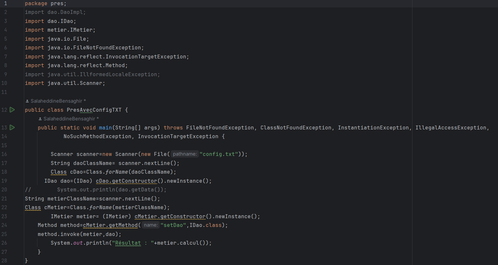

<h2> l'injection des dépendances</h2>

<h2>Par instanciation statique</h2>

<h3>Résultat : </h3>

<h2>instanciation dynamique</h2>

<h3>Résultat : </h3>

<h2>En utilisant le Framework Spring</h2>
<h3>Version XML : </h3>

<h3>Résultat : </h3>

<h3>Version Annotation : </h3>

<h3>Résultat : </h3>

